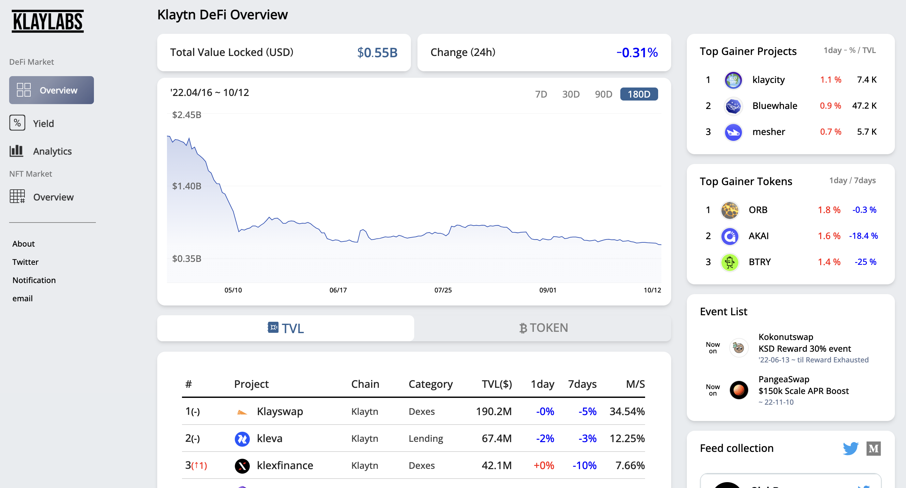

# Background
In the Klaytn ecosystem, more than 60 DeFi projects and more than 100 NFT projects have been created so far. As a result, there is an increasing need to effectively analyze and review many of these projects. However, the service that professionally integrates and analyzes DeFi/NFT project information existing in the Klaytn ecosystem is still lacking compared to other mainnet chains.  
 To solve this situation, Klaylabs develop DeFi and NFT information service. We hope that these activities will eventually contribute to the expansion of the Klaytn ecosystem by improving the accessibility and efficiency of the Klaytn ecosystem.  
  
# Key features of klaylabs  
- Access the largest number of Klaytn DeFi projects (*twice as much as similar site. ex. defillama)   
- Check market status through the trends of major factors  
- Find key information and events for each project easily (TVL, token price, etc.)  
- Find the best apr pools easily  
- Find real transaction list of NFT projects  
- Find overall trading volume of NFT projects ( Opensea + Pala )

# Roadmap
- DeFi data integration and visualization service (As-is)  
- Integrated Data Manipulation Service (To-be)
